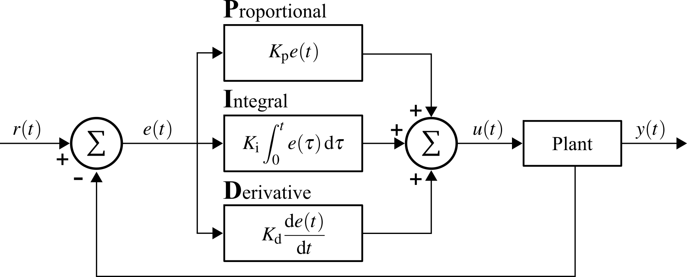

# Engineering Control Systems: A Practical Introduction for Mechanical, Civil, and Aerospace Engineers
This open-source text is designed to offer the reader a complete text on the basics of control theory within the context of Mechanical Engineering. 

A current PDF version of the text can be found by clicking <a href="https://github.com/austindowney/Engineering-Control-Systems/blob/main/Engineering_Control_Systems.pdf">here</a>.

## License

This work is licensed under a Creative Commons Attribution-ShareAlike 4.0 International License [cc-by-sa 4.0].

## Citation

Cite as  
@Misc{DowneyEngineeringControlSystems,  
  author = {Austin Downey and Victor Giurgiutiu},  
  title  = {Engineering Control Systems},  
  url    = {https://github.com/austindowney/Open-Controls},  
}  

